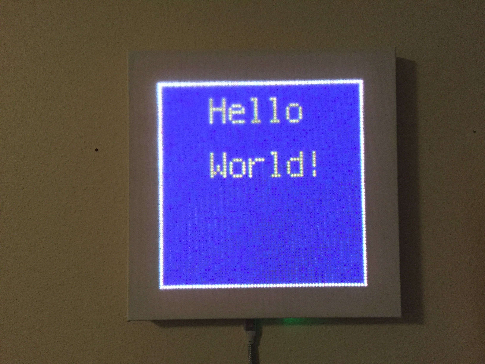
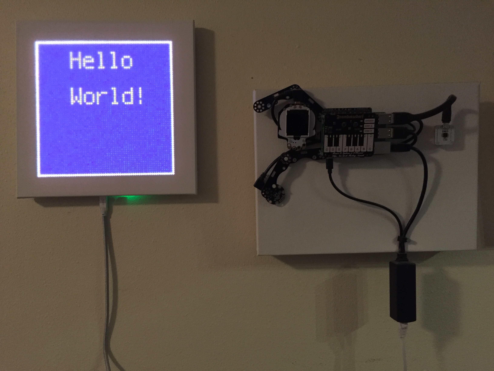

# CompuCanvas MP series



The CompuCanvas MP series uses an Adafruit [Matrix Portal](https://www.adafruit.com/product/4745) (running [CircuitPython](https://circuitpython.org/)) as the system controller.  One of several RGB matrix panels are placed behind the canvas to produce a low resolution display.

## CompuCanvas MP variants
* CompuCanvas MP-32 - 32x32 pixel matrix
* CompuCanvas MP-64h - 64x32 pixel matrix (horizontal)
* CompuCanvas MP-64v - 32x64 pixel matrix (vertical)
* CompuCanvas MP-64x - 64x64 pixel matrix

## CompuCanvas MP construction

Follow the steps in this [Adafruit guide](https://learn.adafruit.com/use-an-art-canvas-to-diffuse-RGB-matrix) to build a CompuCanvas MP.

## CompuCanvas MP software 
The `CCMP` folder here contains a CircuitPython program that will drive the Matrix Portal with features like clocks, background images, message boards and more. To try it:

* You will need to copy these [libraries](https://circuitpython.org/libraries) to the `.../CIRCUITPY/lib` folder:
  * adafruit_bitmap_font
  * adafruit_bus_device
  * adafruit_display_shapes
  * adafruit_display_text
  * adafruit_esp32spi
  * adafruit_imageload
  * adafruit_io
  * adafruit_matrixportal
  * simpleio.mpy
  * neopixel.mpy
  * adafruit_requests.mpy  
* Copy the contents of the `CCMP` folder here into the `CIRCUITPY` folder on the Matrix Portal.
* Edit the `cc_config.py` file in `CIRCUITPY` to configure for your hardware setup.
* Don't forget to create a `secrets.py` file (at the top-level in `CIRCUITPY`) with your WiFi details. You can use this as a template:

```python
secrets = {
  'ssid' : 'insert your WiFi name here',
  'password' : 'insert your WiFi password here',
  #OPTIONAL# 'timezone' : "America/New_York", # http://worldtimeapi.org/timezones
}
```


